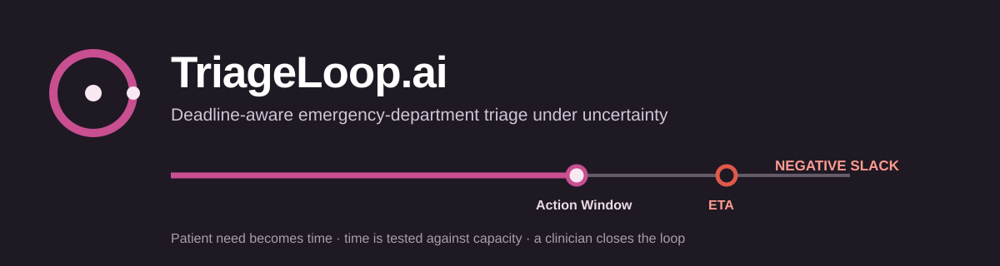
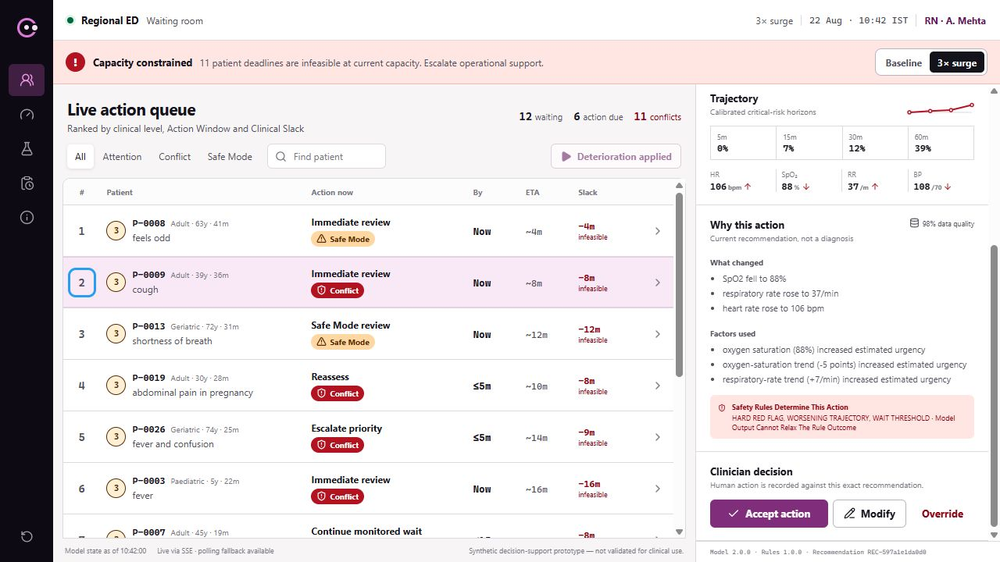
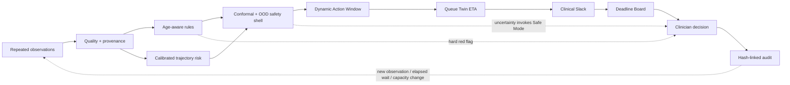
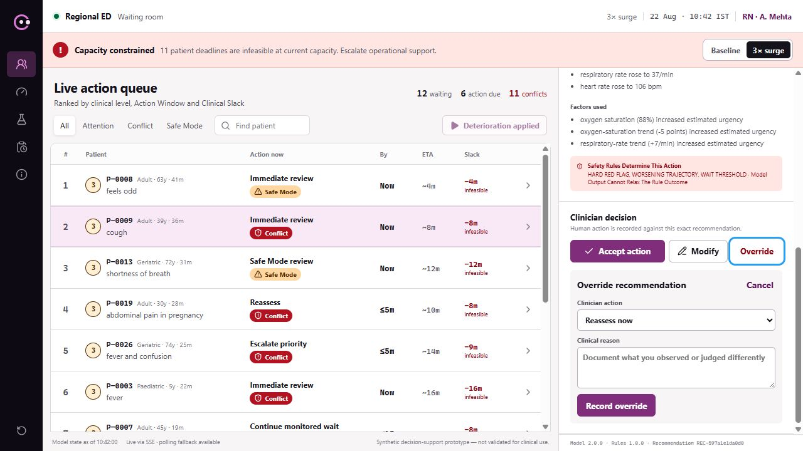
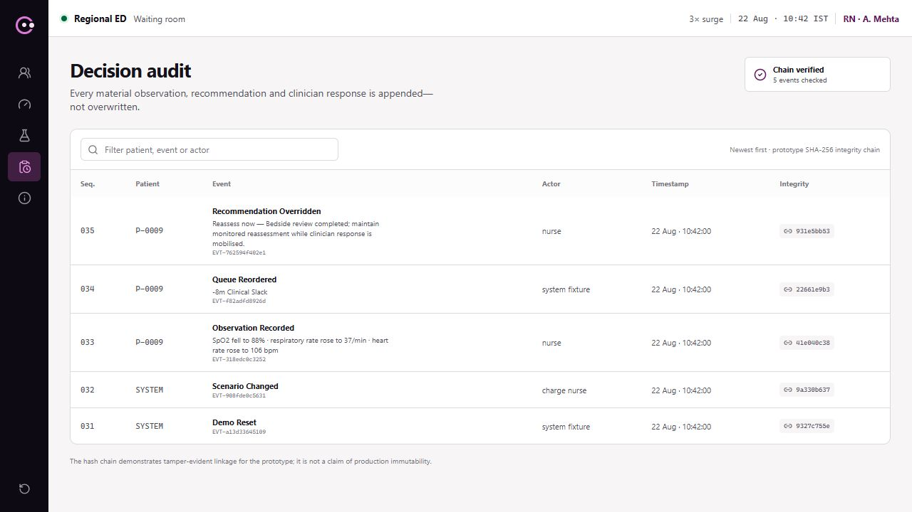
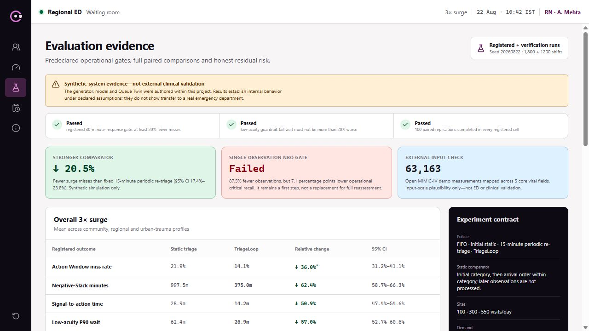

<p align="center">
  
</p>

<p align="center">
  <a href="https://github.com/Hermes-25/TriageLoop-AI/actions/workflows/ci.yml"></a>
  <a href="https://github.com/Hermes-25/TriageLoop-AI/releases/tag/v1.0.0"></a>
  <a href="https://triageloop-ai.vercel.app/board"></a>
  <a href="LICENSE"></a>
  
  
  
</p>

<p align="center">
  <strong>A nurse-led control loop for the patients who change while they wait.</strong><br>
  TriageLoop turns clinical need into a conservative deadline, tests that deadline against the live queue, and keeps the clinician in control.
</p>

<p align="center">
  <a href="https://triageloop-ai.vercel.app/board"><strong>Open the live prototype</strong></a>
  · <a href="submission/video/TriageLoop_Prototype_Demo.mp4">Watch the 2:05 demo</a>
  · <a href="submission/TriageLoop_Technical_Working_Paper_Abhishek_Das.pdf">Read the technical paper</a>
  · <a href="submission/Zeta_TriageloopAI.pdf">View the business proposal</a>
  · <a href="https://github.com/Hermes-25/TriageLoop-AI/releases/tag/v1.0.0">Download the release</a>
</p>

> [!CAUTION]
> **Synthetic decision-support prototype — not validated for clinical use.** TriageLoop does not autonomously diagnose, treat, discharge or downgrade a patient. Do not enter real patient data.

## The idea in one minute

Conventional triage often assigns a category at arrival. The difficult part begins afterwards: symptoms evolve, observations become stale, the waiting room becomes congested, and a clinically appropriate priority can still be operationally impossible.

TriageLoop asks two separate questions:

1. **By when does this patient need another action?** Rules, trajectory risk, uncertainty and data quality produce a conservative **Dynamic Action Window**.
2. **Can the department meet it?** A **Queue Twin** projects time to action. **Clinical Slack = Action Window − projected ETA.** Negative Slack is displayed as a capacity conflict—not hidden by reranking.

**Patient need becomes time. Time is tested against capacity. A clinician closes the loop.**

<p align="center">
  <a href="submission/video/TriageLoop_Prototype_Demo.mp4">
    
  </a><br>
  <sub>Click the working-product capture to open the captioned 2:05 demonstration.</sub>
</p>

## Why it is different

The individual ingredients have precedent. The contribution is their safety-oriented recomposition into one waiting-room operating loop.

| Research idea borrowed from | TriageLoop implementation | Why it matters |
|---|---|---|
| Predictive maintenance and survival analysis | **Dynamic Action Window** | Replaces “How risky?” with “By when must we act?” |
| Real-time operating-system scheduling | **Clinical Slack** | Makes deadline feasibility explicit under changing capacity |
| Active sensing and decision theory | **Next Best Observation** | Suggests the first useful measurement when uncertainty matters |
| Conformal prediction and OOD detection | **Uncertainty safety shell** | Routes uncertain or unfamiliar cases to review/Safe Mode |
| Digital twins and discrete-event simulation | **Queue Twin** | Tests clinical deadlines against site, load and resource constraints |
| Safety-critical human factors | **Clinician decision + hash-linked audit** | Keeps accept/modify/override visible, reasoned and traceable |

The model is intentionally not allowed to suppress a hard red flag, lengthen a rule/category limit, or autonomously downgrade a patient.

## System architecture



The numerical path contains no LLM. Clinical need is calculated before operational feasibility. If the model fails, deterministic rules remain; if the Queue Twin fails, the need stays visible and ETA/Slack becomes unknown; if audit persistence fails, state-changing actions are blocked.

- Full system blueprint: [`paper/diagrams/system_architecture.mmd`](paper/diagrams/system_architecture.mmd)
- Runtime decision flow: [`paper/diagrams/runtime_clinical_pipeline.mmd`](paper/diagrams/runtime_clinical_pipeline.mmd)
- ML development pipeline: [`paper/diagrams/ml_development_pipeline.mmd`](paper/diagrams/ml_development_pipeline.mmd)
- Detailed architecture: [`docs/architecture.md`](docs/architecture.md)
- Safety invariants: [`docs/clinical-safety-contract.md`](docs/clinical-safety-contract.md)

## Working product surfaces

<table>
  <tr>
    <td width="50%"><br><strong>Deadline Board</strong><br><sub>One consolidated action, changing trajectory, deadline, ETA and negative Slack.</sub></td>
    <td width="50%"><br><strong>Clinician decision</strong><br><sub>Accept, modify or override; non-default actions require a documented reason.</sub></td>
  </tr>
  <tr>
    <td width="50%"><br><strong>Audit chain</strong><br><sub>Actor, action, reason, versions and recomputed SHA-256 lineage.</sub></td>
    <td width="50%"><br><strong>Evidence without hiding failure</strong><br><sub>Comparator, confidence interval, workload and failed NBO gate remain visible.</sub></td>
  </tr>
</table>

Additional verified views: [capacity truth](submission/visuals/product-surfaces/05-capacity-truth.png) · [degraded mode](submission/visuals/product-surfaces/06-about-degraded-mode.png) · [all product-surface evidence](submission/visuals/product-surfaces/README.md)

## What was built

- Strict patient, observation, recommendation and queue contracts.
- Quality, freshness, reliability and plausibility checks with Safe Mode.
- Paediatric, adult and geriatric deterministic safety rules.
- Twenty-eight named edge cases, including ambiguity and zero-history patients.
- Seeded 10,000-encounter / 30,020-snapshot longitudinal generator.
- Four calibrated deterioration horizons: 5, 15, 30 and 60 minutes.
- Mondrian conformal sets plus out-of-distribution detection.
- Dynamic Action Windows that take the earliest conservative bound.
- Next Best Observation with an explicit full-reassessment fallback.
- Configurable Community, Regional and Urban Trauma Queue Twin profiles.
- Baseline and 3×-surge scenarios with live ETA and Clinical Slack.
- Nurse-facing Next.js product with deterioration, surge and reset journeys.
- Reasoned clinician decisions and SQLite-backed tamper-evident audit linkage.
- FastAPI endpoints for health, intake, state, recommendations, decisions, audit and evidence.
- Docker Compose reference deployment and bounded Vercel presentation adapter.

The complete problem-statement mapping is in [`docs/requirements-traceability.md`](docs/requirements-traceability.md).

## Evidence, with boundaries

All model and Queue Twin performance below is **synthetic simulation evidence**. It is not evidence of clinical effectiveness, patient benefit, safe staffing or transfer to another hospital.

| Verification item | Result | Required interpretation |
|---|---:|---|
| 3×-surge Action Window misses | 17.7% → 14.1%; **20.5% relative reduction** (95% CI 17.4%–23.8%) | Paired synthetic shifts versus fixed 15-minute periodic re-triage |
| Negative-Slack minutes | **14.0% fewer** | Synthetic operational measure, not a patient outcome |
| Signal-to-action | **15.7% faster** | Synthetic operational measure |
| Low-acuity P90 wait | **14.4% lower** | Registered fairness guardrail only |
| NBO single-observation gate | **Failed:** −7.1 percentage points operational critical recall | NBO remains first-step guidance; full reassessment/escalation is required |
| External input plausibility | 63,163 measurements mapped | Open hospital/ICU demo input scale only; not ED or model validation |

<details>
<summary><strong>How the evaluation was controlled</strong></summary>

- Patients—not rows—were isolated across development, validation and test splits.
- Candidate selection and calibration thresholds used development/validation data only.
- The registered TL-03 matrix contains 1,800 policy shifts across three sites and two loads.
- The stronger TL-05 comparator contains 1,200 paired shifts using fixed 15-minute periodic re-triage.
- A post-verification 10/20/30-minute sensitivity run remained directionally positive at 12.8%/13.0%/24.1%, but only the 30-minute definition exceeded 20%.
- The failed NBO gate was retained in the product and documentation instead of being removed.

Read the [evaluation protocol](docs/evaluation-protocol.md), [model card](docs/model-card.md), [simulation card](docs/simulation-card.md) and [TL-05 verification report](docs/tl-05-verification-report.md).
</details>

## Run the complete product

### Fastest path: Docker

Prerequisite: [Docker Desktop](https://www.docker.com/products/docker-desktop/) or another Docker Engine with Compose.

```bash
git clone https://github.com/Hermes-25/TriageLoop-AI.git
cd TriageLoop-AI
docker compose up --build -d
```

Open:

- **Product:** <http://localhost:3000/board>
- **API health:** <http://localhost:8000/v1/health>

Expected health response:

```json
{"status":"ok","mode":"synthetic-prototype","version":"0.4.0"}
```

Stop without deleting the persistent audit volume:

```bash
docker compose down
```

New to Docker? Read [what Docker does for TriageLoop, in plain English](docs/docker-for-beginners.md).

### The five-minute jury path

1. Open the **Deadline Board**.
2. Select **Run deterioration event**; observe P-0009 move, its Action Window contract and Slack become negative.
3. Open P-0012; inspect the Next Best Observation boundary and full-reassessment fallback.
4. Switch to **3× surge**; see capacity conflict remain visible.
5. Open P-0009, choose **Override**, enter a reason and record it.
6. Open **Audit**; verify the recomputed chain.
7. Open **Evidence** and **Capacity**; inspect results and limitations.

<details>
<summary><strong>Manual developer setup without Docker</strong></summary>

Requirements: Python 3.12+, Node.js 22+ and pnpm via Corepack.

```bash
python -m venv .venv
```

Activate the environment:

```bash
# Windows PowerShell
.venv\Scripts\Activate.ps1

# macOS / Linux
source .venv/bin/activate
```

Install and start the API:

```bash
python -m pip install -e services/api
python -m uvicorn triageloop.api:app --host 127.0.0.1 --port 8000
```

In a second terminal, start the web interface:

```bash
corepack enable
pnpm --dir apps/web install --frozen-lockfile
pnpm --dir apps/web dev
```

The web application proxies requests through `/api/triageloop/*` to `TRIAGELOOP_API_URL`, which defaults to `http://127.0.0.1:8000`.
</details>

<details>
<summary><strong>Regenerate data, models and evaluation artifacts</strong></summary>

After installing the API package:

```bash
python services/api/scripts/generate_data.py
python services/api/scripts/train_models.py
python services/api/scripts/run_queue_experiments.py
python services/api/scripts/run_tl05_periodic_retriage.py
python services/api/scripts/run_tl05_nbo.py
python services/api/scripts/run_tl05_external_plausibility.py
```

Generated population files and local databases are intentionally ignored. The generator specification, seed, curated fixtures, compact selected model and machine-readable evaluation outputs are versioned.
</details>

## Verification

| Gate | Release result | Evidence |
|---|---|---|
| Python contracts, safety, model, queue and product | **73/73 tests passed** | [`tests/`](tests/) |
| TypeScript and Next.js | **Type-check + optimized production build passed** | [CI workflow](.github/workflows/ci.yml) |
| Docker Compose | **API/UI build and health gate passed** | [`tl07-docker-verification.json`](artifacts/release/tl07-docker-verification.json) |
| Browser journey | **8 stages; 0 console errors; 0 page errors** | [`verification.json`](artifacts/release/tl07-live/verification.json) |
| Restart persistence | **5/5 audit events and newest hash preserved** | Docker verification record |
| Reset contract | **1 valid baseline event; chain intact** | Docker verification record |
| Claim control | Comparator, sensitivity, failed NBO and limitations visible | [`docs/source-evidence-register.md`](docs/source-evidence-register.md) |

Run the principal checks locally:

```bash
python -m unittest discover -s tests -p "test_*.py" -v
pnpm --dir apps/web typecheck
pnpm --dir apps/web build
docker compose config --quiet
```

## Repository guide

```text
TriageLoop-AI/
├── apps/web/                 Next.js Deadline Board and jury surfaces
├── services/api/             FastAPI decision, safety, queue and audit engine
├── packages/contracts/       Versioned JSON schemas shared across boundaries
├── data/                     Synthetic specifications and curated fixtures
├── artifacts/                Selected model and machine-readable evaluations
├── tests/                    Contract, safety, model, queue and product tests
├── infra/                    Production Dockerfiles
├── paper/                    LaTeX monograph source, diagrams and figures
├── docs/                     Architecture, safety, research and review records
├── submission/               Proposal, pitch, video, paper and jury checklist
└── compose.yaml              One-command reference deployment
```

Start according to your role:

| You are… | Begin here |
|---|---|
| A competition evaluator | [Live prototype](https://triageloop-ai.vercel.app/board) → [business proposal](submission/Zeta_TriageloopAI.pdf) → [demo video](submission/video/TriageLoop_Prototype_Demo.mp4) → [technical paper](submission/TriageLoop_Technical_Working_Paper_Abhishek_Das.pdf) |
| Non-technical | [Docker for beginners](docs/docker-for-beginners.md) |
| A developer | [API guide](services/api/README.md) and [web guide](apps/web/README.md) |
| An ML researcher | [Evaluation protocol](docs/evaluation-protocol.md), [model card](docs/model-card.md) and [experiment report](docs/tl-02-experiment-report.md) |
| An operations researcher | [Simulation card](docs/simulation-card.md) and [queue experiment report](docs/tl-03-experiment-report.md) |
| A clinical-safety reviewer | [Safety contract](docs/clinical-safety-contract.md), [rule catalogue](docs/safety-rule-catalog.md) and [risk register](docs/risk-register.md) |

## Round 2 submission package

| Deliverable | Editable source | Jury-ready artifact |
|---|---|---|
| Business proposal / jury presentation | — | [11-slide final PDF](submission/Zeta_TriageloopAI.pdf) |
| Technical working paper | [LaTeX](paper/main.tex) | [36-page final PDF](submission/TriageLoop_Technical_Working_Paper_Abhishek_Das.pdf) |
| Prototype demonstration | [Storyboard](submission/demo-storyboard.md) | [2:05 captioned MP4](submission/video/TriageLoop_Prototype_Demo.mp4) |
| Accessible narration | — | [Matching transcript](submission/video/TriageLoop_Prototype_Demo_transcript.md) |
| Integrity and release gate | — | [SHA-256 manifest](submission/release-manifest.sha256) · [checklist](submission/submission-checklist.md) |

### Rebuild the technical paper

The monograph includes the problem-statement traceability, research lineage, system/runtime/ML pipelines, mathematical formulation, synthetic data generation, candidate selection, calibration, conformal/OOD safety, Action Windows, NBO, Queue Twin, Clinical Slack, product/API/audit design, both independent review cycles, validation, deployment and limitations.

```bash
python paper/generate_figures.py
cd paper
tectonic main.tex
```

See [`paper/README.md`](paper/README.md) for dependencies and evidence boundaries.

## Independent review and claim discipline

Two external Claude review cycles were treated as red-team inputs—not as authority. Every finding was independently checked against the implementation and classified as accepted, not reproduced, superseded or open. Confirmed findings produced a stronger comparator, alert-workload reporting, a corrected explanation path, sensitivity analysis, additional product evidence and the Docker clean-build gate.

- [First critique disposition](docs/tl-04.5-critique-disposition.md)
- [Final review disposition](docs/tl-06.5-final-review-disposition.md)
- [Final technical/deployment record](docs/tl-07.5-technical-paper-and-deployment.md)

TriageLoop does **not** claim to be the first AI triage or dynamic queue system. A closely related India-focused OPD simulation combines LLM severity prediction, urgency-drift detection and adaptive queues ([Gupta, Kumar & Dang, 2026](https://arxiv.org/abs/2604.00215)). TriageLoop's narrower distinction is the complete emergency-department waiting-room control loop: deterministic rules first, no LLM in the quantitative path, explicit uncertainty/Safe Mode, patient-specific deadlines, queue feasibility, clinician authority and audit.

## Deployment modes

| Mode | Purpose | Quantitative engine | Persistence |
|---|---|---|---|
| Docker / local | Authoritative reproducible prototype | Live FastAPI rules, model and Queue Twin | SQLite + named Docker volume |
| [Vercel jury preview](https://triageloop-ai.vercel.app/board) | Zero-install demonstration | Canonical FastAPI-exported synthetic snapshots | Small HTTP-only presentation-state cookie |

The hosted adapter is intentionally bounded: it accepts no real patient data and must not be represented as the live Python engine or a clinical deployment.

## Governance and security

The design references India's DPDP framework, ABDM Health Data Management Policy and Indian EHR Standards as architectural inputs—not as a compliance claim. Any hospital pilot would require local clinical governance, prospective validation, identity and role controls, encryption/key management, retention policy, monitored audit storage, incident response, privacy/legal review and human-factors evaluation.

Read [`SECURITY.md`](SECURITY.md) before deploying or reporting a vulnerability. Contributions must follow [`CONTRIBUTING.md`](CONTRIBUTING.md) and the [`CODE_OF_CONDUCT.md`](CODE_OF_CONDUCT.md).

## License and citation

Source code and documentation are released under the [Apache License 2.0](LICENSE). Citation metadata is available in [`CITATION.cff`](CITATION.cff).

---

<p align="center">
  Built for the Accenture Innovation Challenge 2026, Round 2.<br>
  <strong>Calm enough for the waiting room. Exact enough for the audit.</strong>
</p>
