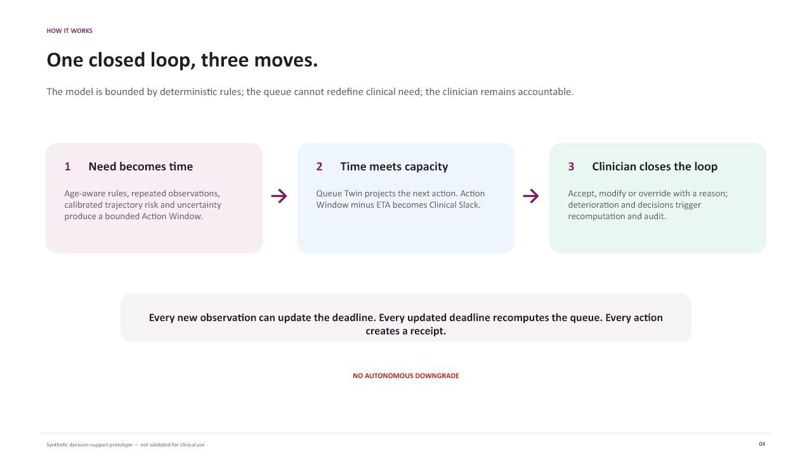
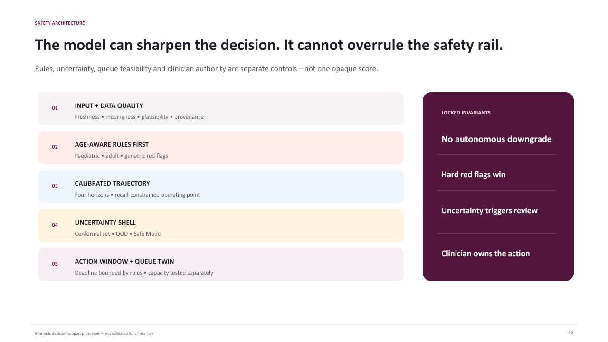
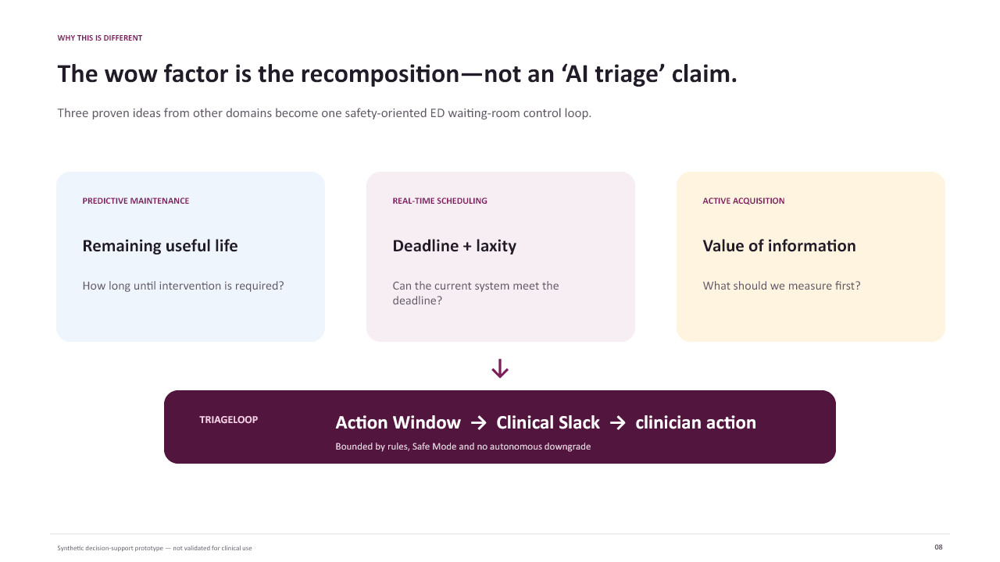
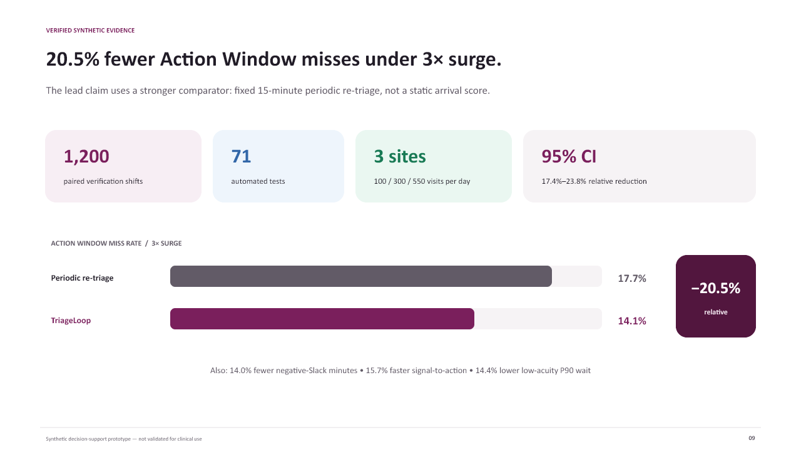

# TriageLoop Architecture and Evidence Visuals

These images are export-ready versions of the core editable pitch slides. They may be used in the proposal, repository, demo video or portal fields without changing the controlled narrative.

## Operating loop

## Safety architecture

## Unique recomposition

## Verification evidence

All numerical results are from registered synthetic experiments. The prototype is not clinically validated.
